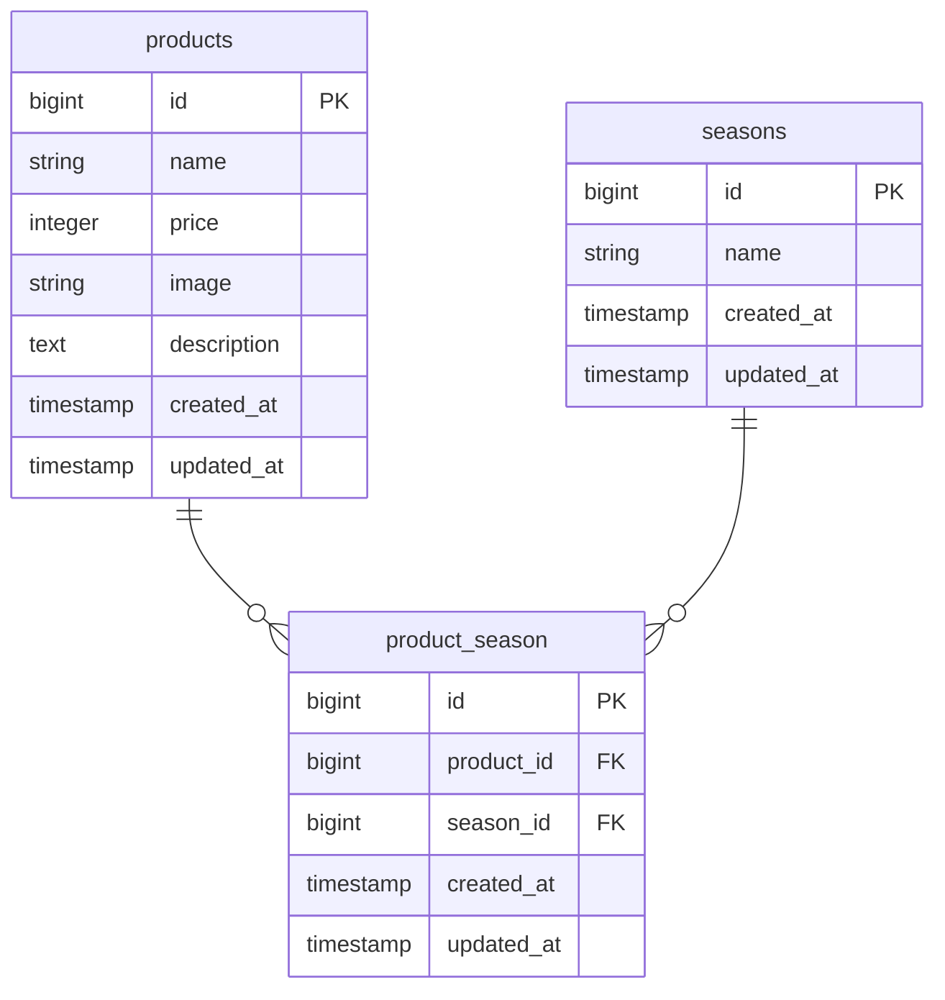

# アプリケーション名
 coachtech もぎたて

## 環境構築

### Dockerビルド
1. git clone git@github.com:itou-nanase/test2.git
2. cd test2
3. docker-compose up -d --build

### Laravel環境構築
1. docker-compose exec php bash
2. composer install
3. cp .env.example .env
4. php artisan key:generate
5. php artisan migrate
6. php artisan db:seed

## 使用技術
- PHP 8.x
- Laravel 8.x
- MySQL
- Docker
- nginx
- 
## URL
- 開発環境：http://localhost/
- phpMyAdmin：http://localhost:8080/
- 商品一覧：http://localhost/products
- 商品詳細：http://localhost/products/detail/{:productId}
- 商品更新：http://localhost/products/{:productId}/update
- 商品登録：http://localhost/products/regiser
- 検索：http://localhost/products/search
- 削除：http://localhost/products/{:productId}/delete
  
# ER図

