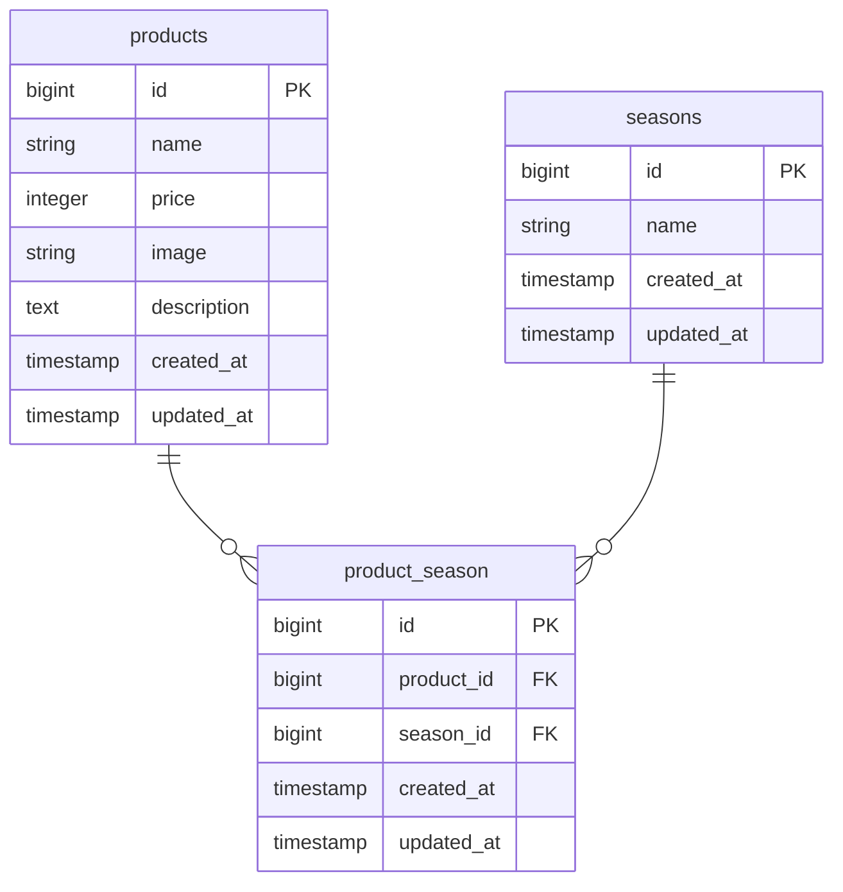

# test2
# coachtech もぎたて

## 環境構築

### Dockerビルド
1. git clone
2. docker-compose up -d --build

### Laravel環境構築
1. docker-compose exec php bash
2. composer install
3. .env.example をコピーして .env を作成
4. php artisan key:generate
5. php artisan migrate
6. php artisan db:seed

## 使用技術
- PHP 8.x
- Laravel 8.x
- MySQL
- Docker
- nginx
- 
## URL
- 開発環境：http://localhost/
- phpMyAdmin：http://localhost:8080/

# ER図

